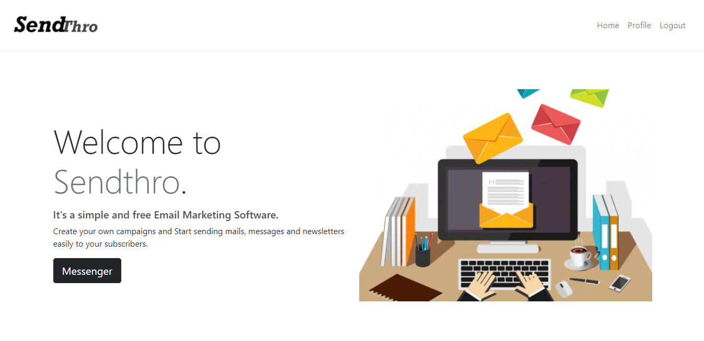

# Sendthro (Email marketing app)
Sendthro is a simple email marketing tool for sending campaigns to your subscribers.
It's built for small businesses and developers who want to send newsletters to their customers or subscirbers.

## Features
- Authentiaction system (Login/Logout/Register)
- Email confirmation
- HTML emails sending
- Subscribing to an account
- Manageing profile and campaings
- Subscribe form
- Fully functional admin panel
- HTML parser and perview

## Tech
- Python
- Django
- Django Celery
- RabbitMQ worker
- PostgreSQL
- Bootstrap
- javascript 


## Installation

Clone git repo.
```
 git clone https://github.com/hsnkh12/email-marketing-app.git
```
Create your python virtual environment.
```
python3 -m venv env
```
Activate it and install requirements needed.
```
source env/bin/activate
```
```
pip3 install -r requirements.txt
```
Add your email configuration in core/settings.py
```
EMAIL_BACKEND ='django.core.mail.backends.smtp.EmailBackend'
EMAIL_HOST = 'smtp.gmail.com'
EMAIL_USE_TLS = True
EMAIL_PORT = 587 
EMAIL_HOST_USER = os.environ['sender_email'] 
EMAIL_HOST_PASSWORD = os.environ['sender_email_password'] 
```
Install and activate your local rabbitMQ server.
https://www.rabbitmq.com/install-windows.html

Activate Django celery worker.
```
celery -A apps.email_sender worker --loglevel=info
```
Run the server and test the the app.
```
Python3 manage.py runserver
```


## UI representation using HTML/Javascript/bootstrap

### Home page



